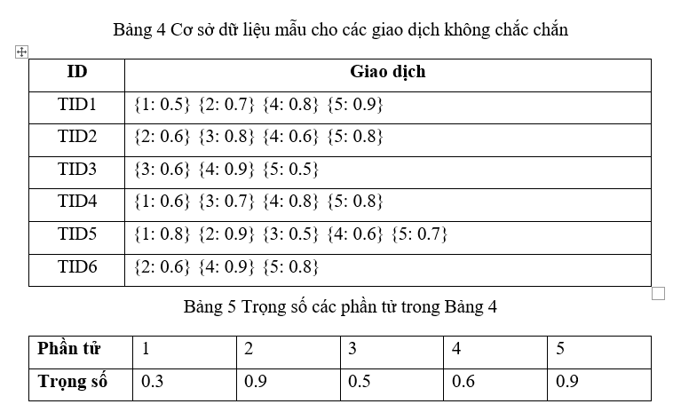
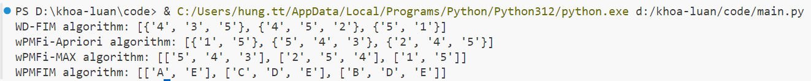

# NGHIÊN CỨU KHAI PHÁ CÁC TẬP MỤC PHỔ BIẾN TỐI ĐA XÁC SUẤT CÓ TRỌNG SỐ

Bài báo cáo được cải biên dựa trên những bài báo

> Efficient weighted probabilistic frequent itemset mining in uncertain databases
> 
> A Weighted Frequent Itemset Mining Algorithm for Intelligent Decision in Smart Systems
> 
> Approximation of Probabilistic Maximal Frequent Itemset Mining Over Uncertain Sensed Data

# Cấu trúc dự án
> code: chứa source code cho các thuật toán
> 
> references: chứa các bài báo tham khảo
> 
> report: chứa file báo cáo
> 

## Thuật toán được cài đặc bằng ngôn ngữ : 
> Python (ipynb)
> 
> Version: 3.12
> 
> Thực thi thuật toán: Download dataset từ Google Drive vào thư mục -> Mở VsCode -> Run all cell

##  Dataset được lưu bằng Google Drive
> Link: https://drive.google.com/drive/folders/1GSBBM_jUCBzddf6w80WwAJce0prxZJ7y?usp=drive_link

## Ví dụ về thuật toán
> ### Dataset:
> 
> 
> ### Kết quả sau khi chạy các thuật toán
> 
> 
